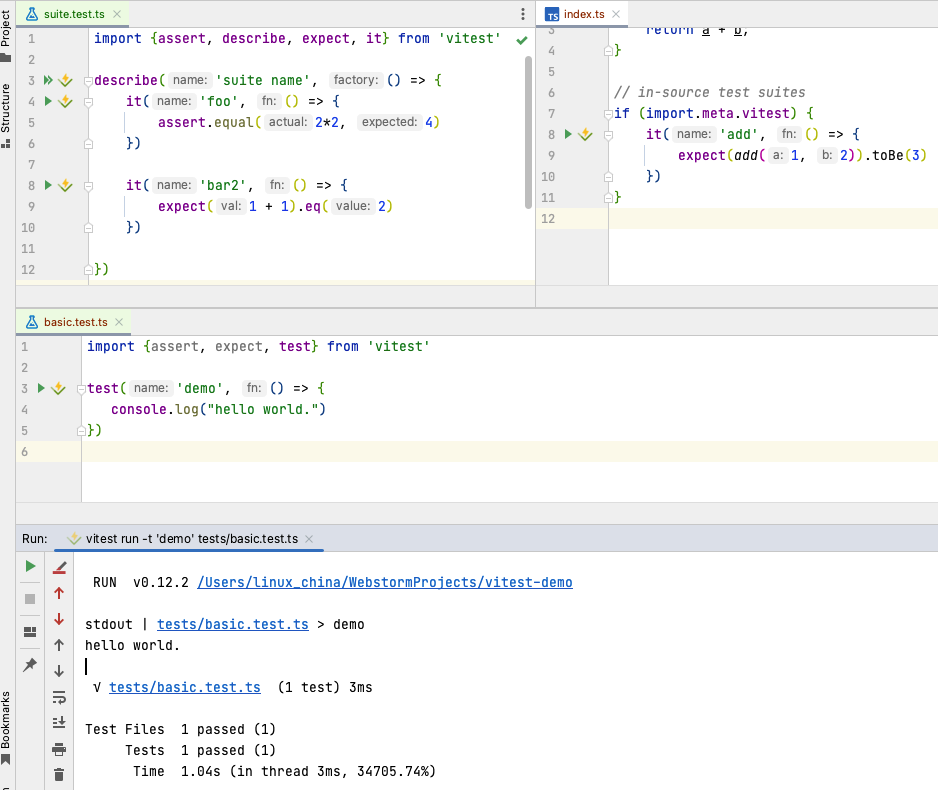

# vitest-jetbrains-plugin

<!-- Plugin description -->
A simple WebStorm plugin to run Vitest test from Gutter.

* Green Run icon means to run once only
* Vitest Run icon means to run with watch mode
* Failure detection to run test method
* Vitest json reporter integration with Vitest run icons by `.vitest-result.json` file

```
  "scripts": {
    "test": "vitest --watch",
    "webstorm-integration": "vitest --watch --reporter=verbose --reporter=json --outputFile=.vitest-result.json",
  },
```

Please install [Awesome Console](https://plugins.jetbrains.com/plugin/7677-awesome-console) for code link/navigation from console.

<!-- Plugin description end -->

# Screenshot



# Attention

This plugin just a temp solution before official Vitest support from WebStorm.
I think JetBrains people will do this job, and they know Vitest is great framework.
For Vitest support in WebStorm, please vote here: https://youtrack.jetbrains.com/issue/WEB-54437

# Vitest global support

Please enable `globals: true` for test in vite.config.ts

```typescript
// vite.config.ts
import {defineConfig} from 'vitest/config'

export default defineConfig({
    test: {
        globals: true,
    },
})
```

**Attention**: Please reload(close/open) project if you enable `globals: true` first time.

# Installation

- Manually:

  Download the [latest release](https://github.com/linux-china/vitest-jetbrains-plugin/releases/latest) and install it manually using
  <kbd>Settings/Preferences</kbd> > <kbd>Plugins</kbd> > <kbd>⚙️</kbd> > <kbd>Install plugin from disk...</kbd>

- Using IDE built-in plugin system: not available now

  <kbd>Settings/Preferences</kbd> > <kbd>Plugins</kbd> > <kbd>Marketplace</kbd> > <kbd>Search for "vitest"</kbd> >
  <kbd>Install Plugin</kbd>

# Todo

* Color output on console for Linux and Mac

# References

* Vitest VS Code plugin: https://marketplace.visualstudio.com/items?itemName=ZixuanChen.vitest-explorer
* Awesome Console plugin: https://plugins.jetbrains.com/plugin/7677-awesome-console
* Building a Plugin for WebStorm – Tutorial for JavaScript Developers: https://blog.jetbrains.com/webstorm/2021/09/building-a-plugin-for-webstorm-part-1/